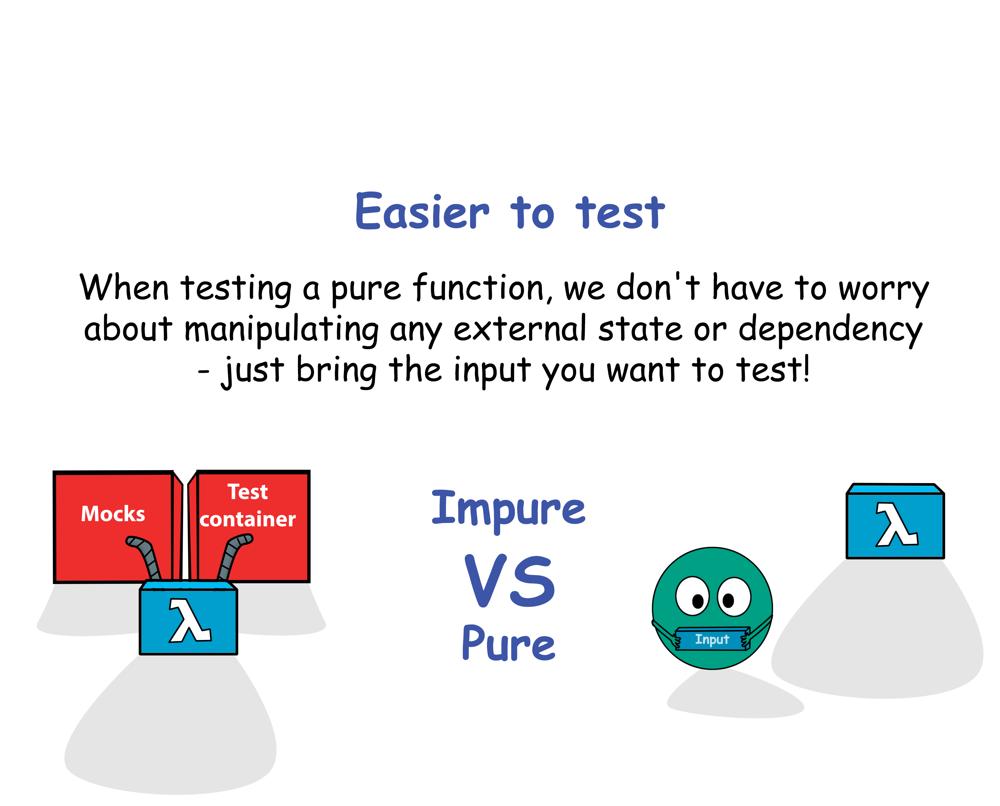

# Pure functions
- TOC
{:toc}

## Description
`Pure functions don’t refer to any global state. Those functions do not produce any side effects (state changes).`

## Why ?
They are easier to **test** because of these properties :
1. You can see all the input in the argument list
2. The execution is deterministic : the same input will always get the same output
3. You can see all the output in the return value : easier to understand / maintain

`Code that is harder to test will lack some or all of these properties.`

There are other benefits than testing from writing only pure functions :
- **Parallelization** : without any shared state to worry about, we can easily parallelize calculations across multiple threads
- **Memoization** : since the same input always result in the same output we can cache the results of our function
- **Lazy evaluation** : we can delay function evaluation only when it's actually needed

## How to
Take some habits :
- Never mutate any input value from a function
- Never mutate the object in which the function is declared
> In both cases, prefer to return a new instance of the object you want to mutate

Apply this simple checklist :

```text
✅ Same inputs always return same outputs
✅ No side-effects
```

## Pure vs Impure functions
### Impure functions
Impure functions often break the [Command Query Separation (CQS)](https://martinfowler.com/bliki/CommandQuerySeparation.html) principle that says we should divide our object methods into 2 separated categories :
- **Queries** : Return a result and do not change the observable state of the system (are free of side effects)
- **Commands** : Change the state of a system but do not return a value.


```java
public class MathUtility {
    private static int countCall = 1;
    public static int sum(int num1, int num2) {
        countCall++;
        multiply(num1,num2);
        return num1 + bnum2;
    }
}
```

```java
public class Line {
    private int value = 0;

    public int add(int nextValue) {
        this.value += nextValue;
        return this.value;
    }
}
```

### Pure functions
Pure functions are in fact queries on our system.



```javascript
const double = x => x * 2;
```

```python
import random

def f(x):
    if random.randint(1, 2) == 1:
        return x + 1
    return x + 2
```

## Constraint
Write only pure functions during the next 20 minutes.
If you are working on a method / function right now : refactor it to make it pure.

## Resources
- [The Definition of "Pure Function"](https://alvinalexander.com/scala/fp-book/definition-of-pure-function/)
- [Why Pure Functions? - 4 benefits to embrace](https://www.deadcoderising.com/2017-06-13-why-pure-functions-4-benefits-to-embrace-2/)
- [CommandQuerySeparation](https://martinfowler.com/bliki/CommandQuerySeparation.html)

Feature images: [Marius Herring](https://www.deadcoderising.com/2017-06-13-why-pure-functions-4-benefits-to-embrace-2/)