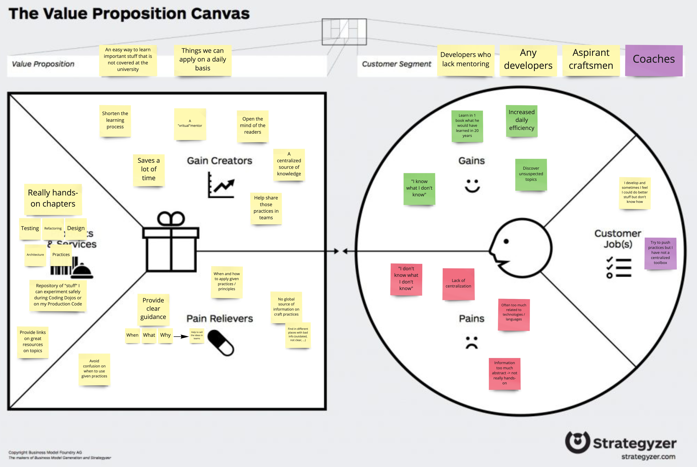

# Xtrem TDD
[](https://github.com/les-tontons-crafters/xtrem-tdd/actions/workflows/contributors.yml)

This repository is used to generate a knowledge base / book to help developers discover useful topics.  
For now it is hosted here [here](https://xtrem-tdd.netlify.app/)



## Pitch of the site
**Software engineering** has been around for decades.
Still, we tend to constantly spend time **investigating problems** that were **already solved** numerous times in the past.

**We've been there too** due to a lack of easy access to reliable information. This is precisely the purpose of this site : act as a mentor allowing you to find solutions and grow continuously.

It aims to provide solutions, ideas and resources to solve problems we've observed countless times like :
- I found my test suite being brittle, every change causes dozens of tests to fail
- I found our understanding of the business being approximate, we don't know what should happen in our domain
- I found we have a lot of Branches in our processes that throw exceptions, it makes it really hard to follow
- I found we often violate our Software Architecture principles, it creates a lot of tension
- I found my tests not providing a reliable output, debugging is always mandatory
- And much more...

While there can be discussions about choices and preferences, this book does not represent the opinion of an individual.
It is, in fact, a **collective effort** from **dozens of passionate experts** towards the same goal, accumulating more than a hundred years of professional experience together.

This site will be the perfect companion for your developer journey.

### For who ?
This site is ideal for :
- Programmers who lack guidance and mentoring
- Aspirant Software Craftsmen keen to learn new practices continuously
- Technical coaches who want to add tools to their own toolbox

### Our values
- Keen to share our knowledge with the whole community
- Steadily seeking how to build the thing right
- Continuously improving and learning

## How to
### Contribute
`To Do`

### Run the site locally
This website is generated through [gatsby](https://www.gatsbyjs.com/) :
- [Install yarn](https://classic.yarnpkg.com/lang/en/docs/install/) 
- Run the folowing commands :
```shell
yarn #install the dependencies
yarn dev #run the site locally
```

## Contributors

<table>
<tr>
    <td align="center" style="word-wrap: break-word; width: 150.0; height: 150.0">
        <a href=https://github.com/ythirion>
            
            <br />
            <sub style="font-size:14px"><b>Yoan Thirion</b></sub>
        </a>
    </td>
    <td align="center" style="word-wrap: break-word; width: 150.0; height: 150.0">
        <a href=https://github.com/Tr00d>
            
            <br />
            <sub style="font-size:14px"><b>Guillaume Faas</b></sub>
        </a>
    </td>
</tr>
</table>
