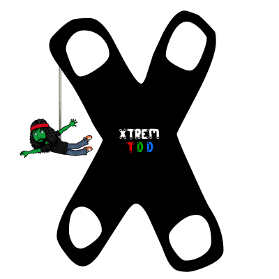

# Xtrem TDD

This repository is used to generate a knowledge base to help developers discover useful topics.  
For now it is hosted here [here](https://xtrem-tdd.netlify.app/)

More explanations [here](PITCH.md)

## How to contribute
We welcome contributions to this repository!
[How to](CONTRIBUTE.md)

## Contributors

<table>
<tr>
    <td align="center" style="word-wrap: break-word; width: 150.0; height: 150.0">
        <a href=https://github.com/ythirion>
            
             
            <b>Yoan Thirion</b>
        </a>
    </td>
    <td align="center" style="word-wrap: break-word; width: 150.0; height: 150.0">
        <a href=https://github.com/Tr00d>
            
             
            <b>Guillaume Faas</b>
        </a>
    </td>
    <td align="center" style="word-wrap: break-word; width: 150.0; height: 150.0">
        <a href=https://github.com/valentinacupac>
            
             
            <b>Valentina Cupać (Валентина Цупаћ)</b>
        </a>
    </td>
    <td align="center" style="word-wrap: break-word; width: 150.0; height: 150.0">
        <a href=https://github.com/matiaspakua>
            
             
            <b>Matias Miguez</b>
        </a>
    </td>
    <td align="center" style="word-wrap: break-word; width: 150.0; height: 150.0">
        <a href=https://github.com/Arsero>
            
             
            <b>Azzedine E.</b>
        </a>
    </td>
    <td align="center" style="word-wrap: break-word; width: 150.0; height: 150.0">
        <a href=https://github.com/pitchart>
            
             
            <b>Julien VITTE</b>
        </a>
    </td>
</tr>
</table>

## License
This work is licensed under a [Creative Commons Attribution-ShareAlike 4.0 International License](https://creativecommons.org/licenses/by-sa/4.0/).